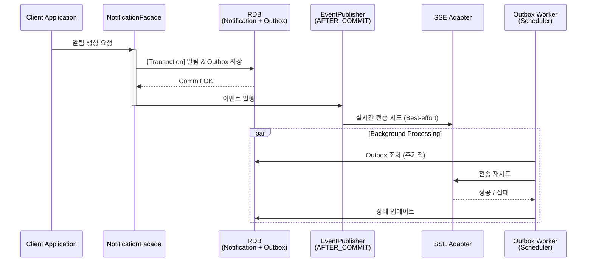

# 🔔 notify-kit

> **Spring Boot 기반의 재사용 가능한 알림 도메인 모듈**
> > "비즈니스 로직과 알림 인프라의 결합도를 낮추고, 신뢰성 있는 알림 전송을 보장한다."

---
## 🚀 Project Overview

**notify-kit**은 모든 서비스에서 공통적으로 필요한 **알림(Notification)** 기능을 독립된 라이브러리 형태로 제공하는 백엔드 모듈입니다. 단순히 알림을 보내는 것을 넘어, **트랜잭션 정합성**과 **전송 신뢰성**을 보장하는 아키텍처를 지향합니다.

- **Core 모듈**: 순수 Java 기반의 비즈니스 로직 (의존성 최소화)
- **Starter 모듈**: Spring Boot AutoConfiguration을 통한 즉시 적용 가능

---
## 🏗 Architecture & Design
### 1. Port & Adapter (Hexagonal) Layout

비즈니스 로직이 특정 기술(JPA, SSE)에 의존하지 않도록 인터페이스(Port)를 통해 외부 세계와 소통합니다. 이를 통해 저장소나 전송 매체를 손쉽게 교체할 수 있습니다.
### 2. Event-Driven Reliability (Transactional Outbox)

---
## ✨ Key Features

### ✅ Core Notification

- **다양한 조회 전략**: Offset 기반 페이징 및 대용량 처리를 위한 Cursor(No-Offset) 구조 지원
- **상태 관리**: 단건/전체 읽음 처리 및 도메인 이벤트 기반 흐름 제어
### ✅ Reliable Delivery (Outbox & Worker)

- **전송 보장**: SSE 전송 실패나 서버 다운 시에도 Outbox에 기록된 데이터를 통해 유실 없는 알림 전달
- **중복 방지**: `eventId` 기반의 Idempotency를 보장하여 동일 알림 중복 발송 방지 (진행중)
### ✅ Real-time SSE (Server-Sent Events)

- **Multi-Device Support**: 한 사용자의 다중 브라우저/기기 연결 지원
- **Resubscription**: `Last-Event-ID`를 활용하여 연결 끊김 시점 이후의 누락된 알림 재전송
- **Scalability**: `notify.sse.enabled=true/false` 설정을 통한 유연한 활성화

---

## 📖 Technical Decision Records (Deep Dive)

프로젝트를 진행하며 고민했던 설계적 선택의 근거들입니다. 자세한 내용은 `docs/`에서 확인하실 수 있습니다.
- **[Why NotificationFacade?](docs/design/Why_NotificationFacade.md)**: 복잡한 트랜잭션과 이벤트 오케스트레이션을 캡슐화한 이유
- **[SSE vs WebSocket](docs/design/Why_SSE_instead_of_websocket.md)**: 알림 서비스에 단방향 통신인 SSE가 더 적합했던 이유
- **[Outbox 기반 신뢰성 전송](docs/architecture/outbox-reliability.md)**: 메시지 브로커 없이 RDB만으로 전송 신뢰성을 확보하는 방법 (작성예정)
- **[Soft Delete vs State Transition](docs/design/Why%20not%20use%20save%20for%20state%20transitions.md)**: 변경 감지(Dirty Checking)를 통한 상태 관리 전략