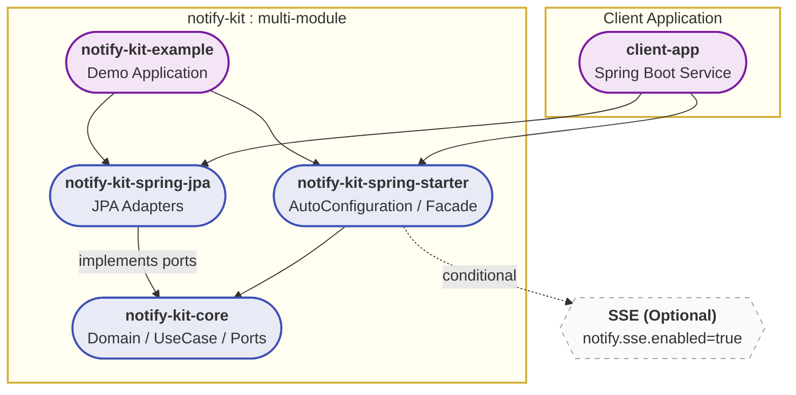
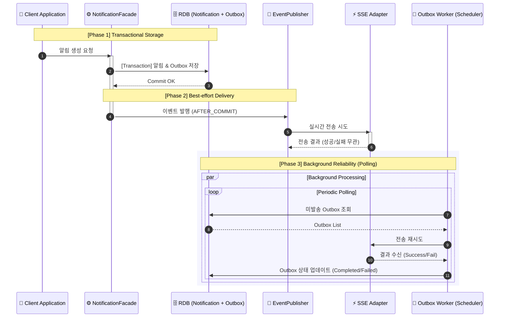

# 🔔 notify-kit

**Spring Boot 기반의 재사용 가능한 알림 도메인 모듈**

notify-kit은 알림 기능을 독립된 모듈로 제공하며, **비즈니스 로직과 알림 발송 간의 원자성(Atomicity)**을 보장합니다. 단순히 메시지를 보내는 것을 넘어, 외부 서비스 장애 시에도 데이터 유실 없는 전송 신뢰성을 지향합니다.

---
## 🏗 Architecture & Design
### 1. Port & Adapter (Hexagonal) Layout
비즈니스 로직이 JPA나 SSE 같은 특정 기술에 종속되지 않아 확장과 교체가 용이합니다.

### 2. Event-Driven Reliability (Transactional Outbox)
알림 저장과 Outbox 기록을 하나의 트랜잭션으로 묶어, 전송 실패 시에도 백그라운드 워커가 재시도하여 신뢰성을 확보합니다.

---
## ✨ Key Features

### ✅ Core Notification & Reliability

- **전송 보장**: SSE 실패나 서버 다운 시에도 Outbox 데이터를 통해 유실 없는 알림 전달
- **중복 방지**: `eventId` 기반의 Idempotency를 보장하여 동일 알림 중복 발송 방지 (*work in progress*)
- **다양한 조회 전략**: Offset 기반 페이징 및 대용량 처리를 위한 Cursor(No-Offset) 구조 지원

### ✅ Real-time SSE (Server-Sent Events)

- **Multi-Device Support**: 한 사용자의 다중 브라우저/기기 연결 지원
- **Resubscription**: `Last-Event-ID`를 활용하여 연결 끊김 시점 이후의 누락된 알림 재전송
- **Flexible Enable**: `notify.sse.enabled=true/false` 설정을 통해 동적 활성화 가능

### ✅ Developer Experience
- **Spring Boot Starter**: AutoConfiguration을 통해 의존성 추가만으로 즉시 적용
- **Clean Code**: 순수 Java 기반의 Core 모듈로 비즈니스 로직 침투 최소화

---

## 📖 Technical Decision Records (Deep Dive)

프로젝트를 진행하며 고민했던 설계적 선택의 근거들입니다. 자세한 내용은 `docs/`에서 확인하실 수 있습니다.
- **[Why NotificationFacade?](docs/design/Why_NotificationFacade.md)**: 복잡한 트랜잭션과 이벤트 오케스트레이션을 캡슐화한 이유
- **[SSE vs WebSocket](docs/design/Why_SSE_instead_of_websocket.md)**: 알림 서비스에 단방향 통신인 SSE가 더 적합했던 이유
- **[Outbox 기반 신뢰성 전송](docs/architecture/outbox-reliability.md)**: 메시지 브로커 없이 RDB만으로 전송 신뢰성을 확보하는 방법 (*작성예정*)
- **[Soft Delete vs State Transition](docs/design/Why%20not%20use%20save%20for%20state%20transitions.md)**: 변경 감지(Dirty Checking)를 통한 상태 관리 전략